# TwoHobby – Social & Dating Platform
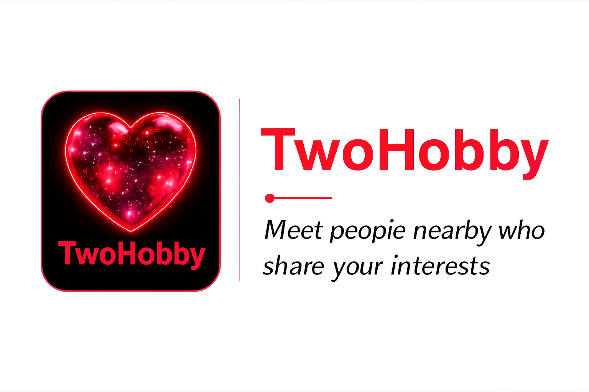

[View Live Website TwoHobby](https://twohobby-978688a704ee.herokuapp.com/)


### Developer: [Azamat Kashebayev](https://github.com/akashebaev-ux)

## Overview

**TwoHobby** is a modern social connection platform inspired by real-time communication apps and social discovery systems.

The platform combines elements of community-driven applications such as Threads with the discovery-based experience of platforms like Badoo and Tinder. Its goal is to create a more meaningful and private environment where people can connect through shared interests, hobbies, values, and authentic interaction.

TwoHobby allows users to share thoughts, posts, and experiences exclusively with people they have marked as liked. Only liked users can exchange feedback, ideas, and private messages within their social circle, creating a more personal and engaging communication environment.

The platform is designed to encourage genuine social interaction beyond traditional dating-focused applications. By combining hobby-based discovery, private social networking, instant messaging, and real-time communication features, TwoHobby creates a space where users can build friendships, relationships, and communities based on common ground.


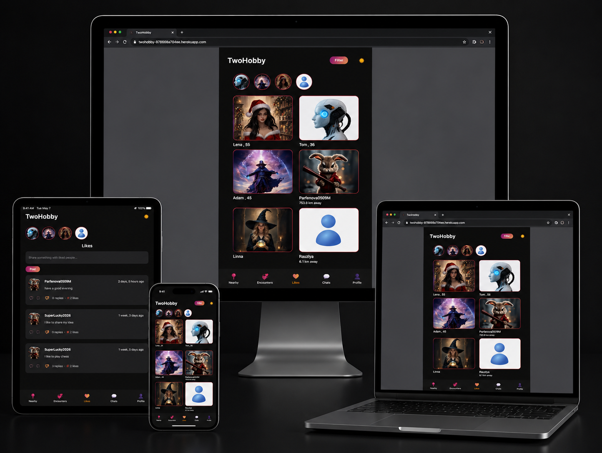

source: [ChatGTP](https://chatgpt.com/)

**NOTE**: Due to security and browser restrictions across different devices, screenshots of the application were captured separately on desktop, tablet, and mobile devices, then professionally combined into a single responsive showcase image using ChatGPT.


---

## Project Focus

This project focuses on:

- Real-time communication
- Responsive mobile-first user experience
- Scalable communication systems
- Optimized media delivery
- Private and meaningful social interaction
- Full-stack web development practices
- Efficient and cost-optimized infrastructure design

---


## The 5 Planes of UX
---

### 1. Strategy

**Purpose**

- TwoHobby exists to provide people with a modern and engaging platform where they can connect with others through shared hobbies and interests. 
- The platform combines social interaction, messaging, profile discovery, and matching features in a clean mobile-first experience inspired by modern social and dating applications.

**Needs**

- **Site owners** require an efficient and intuitive system for managing users, moderating content, and maintaining a secure, welcoming, and high-quality platform experience.
- **Registered users** require a seamless way to discover people with shared interests, engage through likes, posts, and messaging, and build meaningful social connections.
- **Business partners** require an attractive and responsive platform that enables them to promote advertisements, build targeted communities through content and posts, and effectively engage with potential clients.

**Business Goals**

- Establish TwoHobby as an engaging social platform focused on shared interests and meaningful connections.
- Grow an active user community through interactive features such as posts (similar to Threads), messaging and calls (similar to WhatsApp), encounters (similar to Tinder), and profile discovery (similar to Badoo).
- Encourage guest users to create accounts through an appealing, intuitive, and user-friendly experience.
- Maintain a safe and trustworthy environment through moderation tools, reporting systems, and account management features.
---

## 2. Scope

### Features
- User authentication and profile management
- Profile discovery and matching system
- Likes and connection requests
- Real-time private messaging and calls
- Encounters feature (similar to Tinder swipe system)
- Nearby users discovery
- Post sharing and social feed functionality
- User blocking and reporting tools
- Dark/light mode support
- Responsive mobile-first design
- Admin moderation and management tools

---

## Functional Requirements

### Authentication and Access Control
- Users can register, log in, and log out securely.
- Authentication state is maintained across sessions.
- Restricted pages and features require authentication.
- Unauthenticated users attempting to access protected pages are redirected to the login page.
- Role-based permissions are implemented for guest users, registered users, and administrators.

### Profile Management
- Registered users can create, view, update, and manage their profiles.
- Users can upload profile images and personal information.
- Users can set preferences such as gender, age, and bio/hobbies/interests.

### Social Interaction Features
- Users can browse profiles and discover other users.
- Users can like profiles and create mutual connections.
- Users can send and receive private messages/images in real time.
- Users can initiate audio calls.
- Users can block or report inappropriate users.

### Posts and Community Features (CRUD)
- Registered users can create, read, update, and delete posts.
- Users can like posts and interact with community content.
- Only selected/liked users can read, view, or comment on posts.
- Posts are displayed dynamically in social-feed style layouts.

### Encounters and Discovery
- Users can access an encounters feature to discover potential matches.
- Users can filter profiles by gender and age.
- Nearby users are displayed dynamically based on available location data.

### Admin Functionality
- Administrators can manage users through the Django admin panel.
- Administrators can moderate profiles, posts, and messages.
- Administrators can delete inappropriate or harmful content.
- Administrators can manage reports and blocked content.

### User Validation
- Forms include validation and user-friendly error handling.
- Interactive elements provide clear visual feedback for usability.

---

## Content Requirements

### Static Content
- Brand identity and logo
- Navigation
- Landing page

### Admin Managed Content
Managed through the Django admin panel:
- User moderation
- Reports and blocked accounts

### User Generated Content
Created dynamically by registered users:
- User profiles
- Profile images
- Posts and captions
- Likes and matches
- Private messages
- User blocking actions

### System Generated Content
Automatically generated by the platform:
- Matching system
- Like counts
- Validation
- Message timestamps and ordering

---

## Constraints

- Profile bios are limited in length to maintain clean layouts and readability.
- Profile images are limited according to Cloudinary upload restrictions.
- Audio calls are limited to 1 minute. 
- Video uploads are not currently supported.
- The platform currently supports only the English language.
- Reactive moderation is used, meaning content is moderated after publication through admin reviews.
- The website has restrictions preventing it from being displayed on third-party websites for security reasons.
- Calls require mutual connections or platform permissions depending on user settings. The connect and disconnect system still requires further development.
- A success message system still needs to be implemented on the registration page.

---


## 3. Structure

### Information Architecture

#### Navigation Menu
The navigation system provides quick access to the main areas of the platform:
- Home
- Nearby Users
- Encounters
- Messages
- Likes and Matches
- User Profile
- Login / Logout / Registration
- Settings and Theme Toggle

---

### Hierarchy

- The homepage(nearby) provides a welcoming introduction to the platform with clear navigation to core features.
- Users are encouraged to create an account through visible call-to-action buttons and interactive features.
- Profiles are displayed in clean card-based layouts optimized for mobile-first usability.
- Nearby and Encounters pages prioritise profile images, age, interests, and interaction buttons.
- Messages are organised in a real-time chat interface similar to modern messaging applications.
- Posts and social content are displayed in reverse chronological order for easy browsing.
- Navigation is simplified using a bottom navigation bar for mobile users and intuitive layouts for tablets and desktops.
- Important actions such as liking, messaging, matching, blocking, and reporting are visually highlighted.

---

## User Flow

### Guest Users

- Guest users land on the homepage(nearby) and can explore the platform interface.
- Guests can browse public profiles and view limited social content.
- Guests are encouraged to register through visible sign-up buttons and engagement prompts.
- Attempting to access restricted features such as messaging, likes, or encounters redirects guests to the login page.
- Guests can read community guidelines and platform information before registering.

---

### Registered Users

- Registered users log into their accounts and access the main platform features.
- Users browse nearby profiles and discover potential matches.
- Users can like profiles and create mutual connections.
- Users can access the encounters feature to quickly discover new users.
- Users can send and receive private messages in real time.
- Users can initiate calls and interact through the messaging system.
- Users can create, update, and manage their profiles.
- Users can create posts, interact with content, and receive notifications.
- Users can block or report inappropriate accounts.
- Confirmation and feedback messages are displayed throughout user interactions.
- Users can log out securely to protect account privacy.

---

### Admin Users

- Administrators log into the platform with elevated permissions.
- Admins can access the Django admin panel to manage platform content.
- Admins can moderate profiles, posts, messages, and reported content.
- Admins can delete inappropriate or harmful user-generated content.
- Admins can review user reports and take moderation actions when necessary.
- Admins can manage user accounts, including suspending or removing accounts that violate community rules.
- Admins can manage platform announcements and featured content.
- Admins monitor the platform to maintain a safe and welcoming environment for users.


---

## User Stories

| Target | Expectation | Outcome | Priority |
|---|---|---|---|
| As a Site User | I can browse user profiles<br>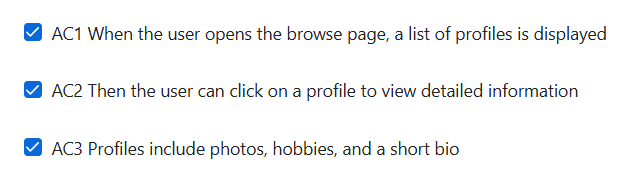 | so that I can find people I’m interested in |  |
| As a Site User | I can open a user’s profile<br>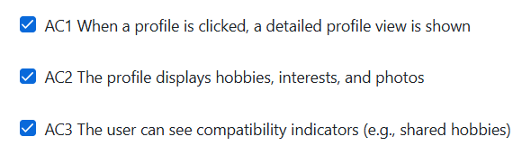 | so that I can learn more about them |  |
| As a Site User | I can register an account<br>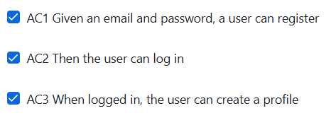 | so that I can use the dating features |  |
| As a Site User | I can create and edit my profile<br>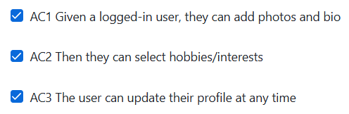 | so that others can learn about me |  |
| As a Site User | I can like or pass profiles<br>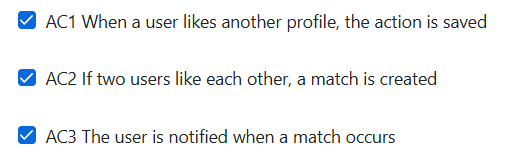 | so that I can find matches |  |
| As a Site User | I can send messages to matched users<br>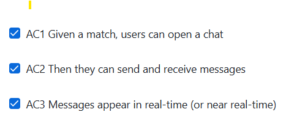 | so that I can communicate with them |  |
| As a Site User | I can view and manage my matches<br>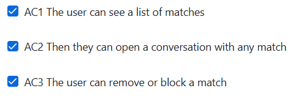 | so that I can organize my connections |  |
| As a Site User | I can filter profiles<br>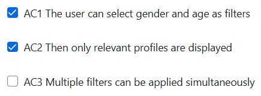 | so that I can find compatible people |  |
| As a Site User | I can report or block users<br>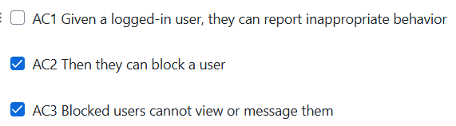 | so that I can feel safe on the platform |  |
| As a Site User | I can receive notifications<br>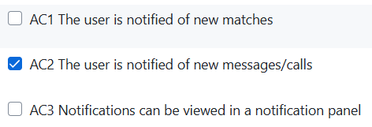 | so that I don’t miss matches or messages |  |
| As a Site Admin | I can manage user accounts<br>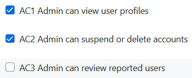 | so that I can maintain platform quality |  |
| As a Site Admin | I can moderate profiles and messages<br>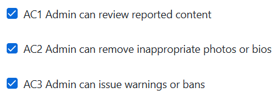 | so that the platform remains safe |  |


---

# Features


## Features

### Existing Features

| Feature | Notes | Screenshot |
|---|---|---|
| Landing page | Users can create an account using Django allauth. | 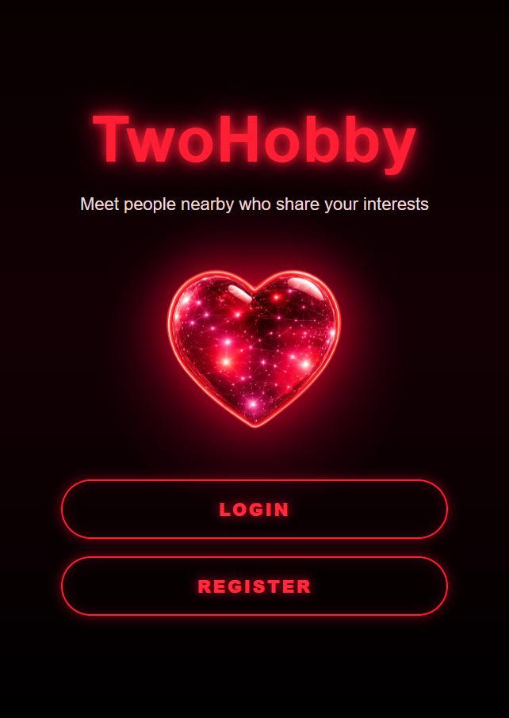 |
| Register | Users can register an account by adding a username, email (optional), and password. | 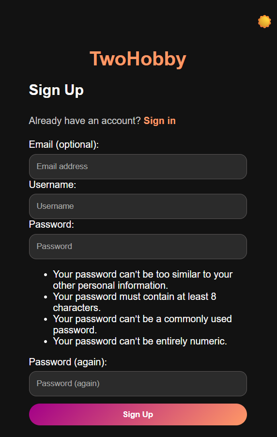 |
| Login | Existing users can log in and access protected pages. | 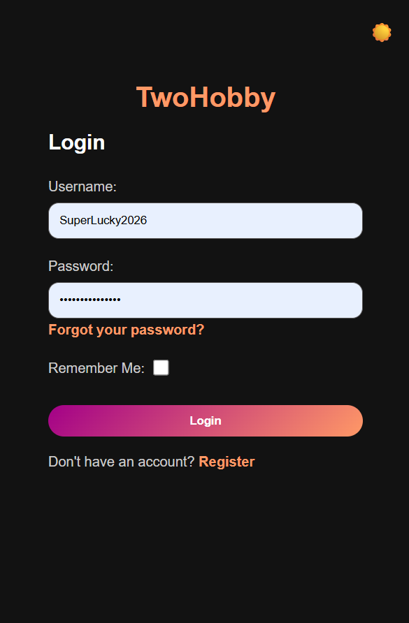 |
| Password reset | Existing users can reset their password to regain access to their protected profile page. | 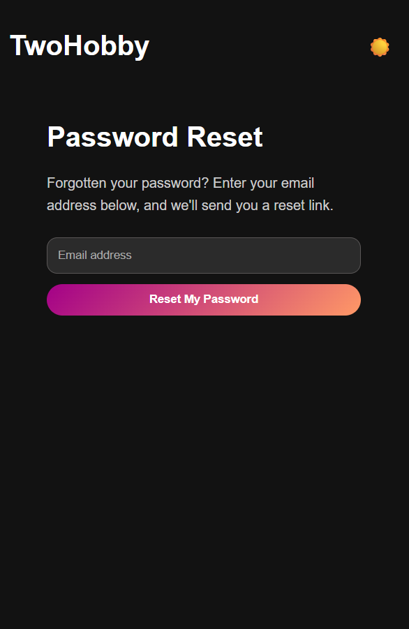 |
| Success page | The success page informs users that their password reset request has been submitted successfully. | 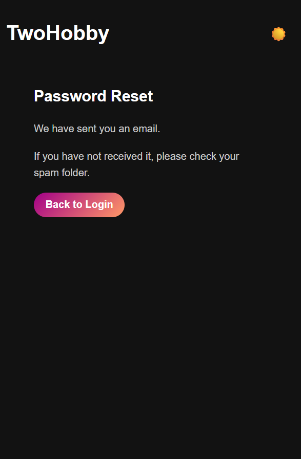 |
| Logout | Logged-in users can securely log out using the logout button on their profile page. | 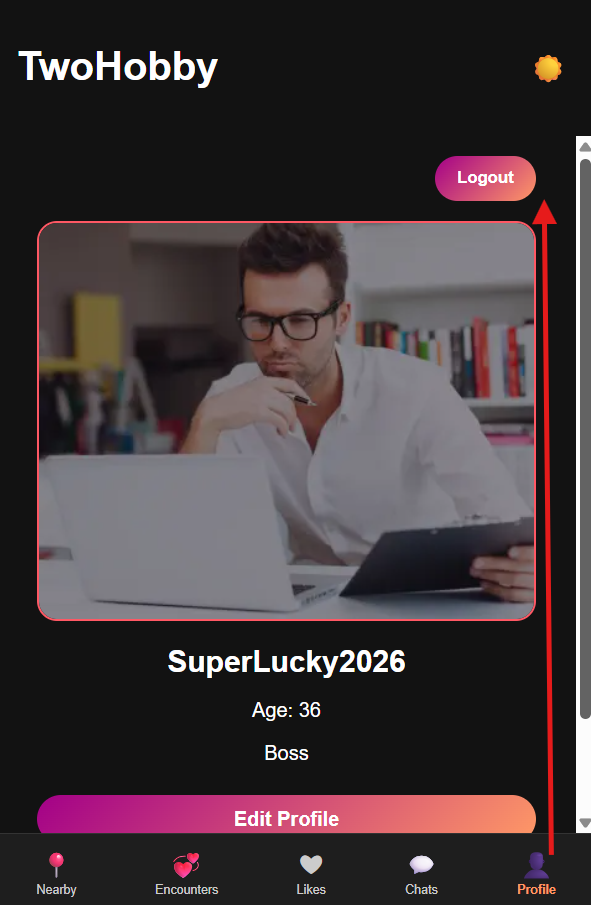 |
| Responsive Layout | The website is designed to work on desktop and tablet devices, but mainly for mobile screens. | 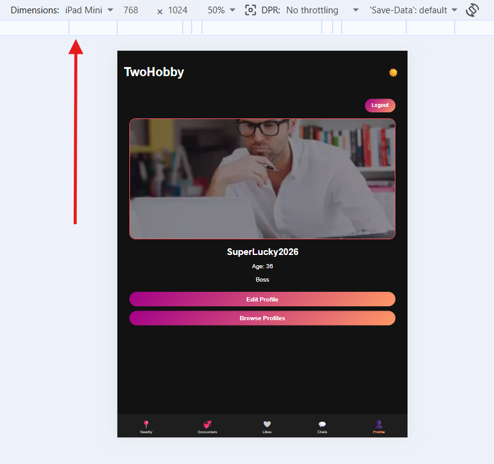 |
| Dark / Light Mode | Users can switch between light and dark mode for a better viewing experience. | |
| Nearby | Users can browse nearby profiles and see profile cards. | 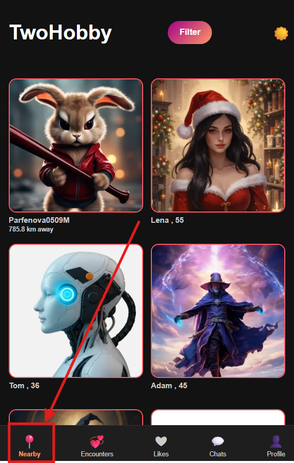 |
| Profile | Users can see their own profile image, name, age, and bio. |  |
| Profile Detail | Users can open a full profile page to see more information about another user. |  |
| Edit Profile | Users can update their own profile information and profile image. |  |
| Encounters | Users can like other profiles to show interest. | 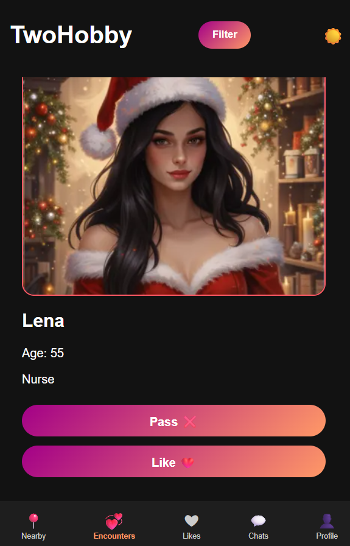 |
| Likes | Users can view profiles they have liked and create group posts where only liked profiles can view and comment on them. | 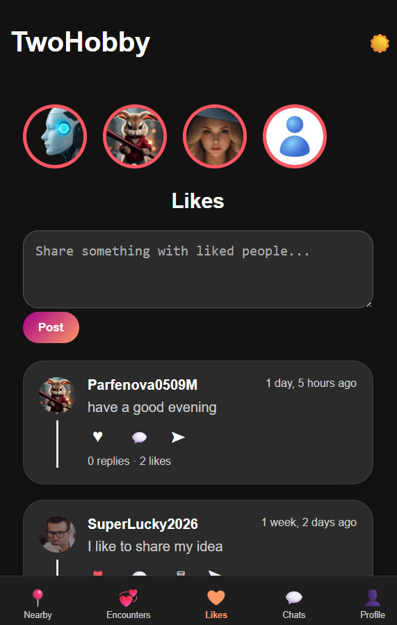 |
| Posts | Users can create posts connected to their profile and interests. |  |
| Comments | Users can comment on posts and interact with other users. | 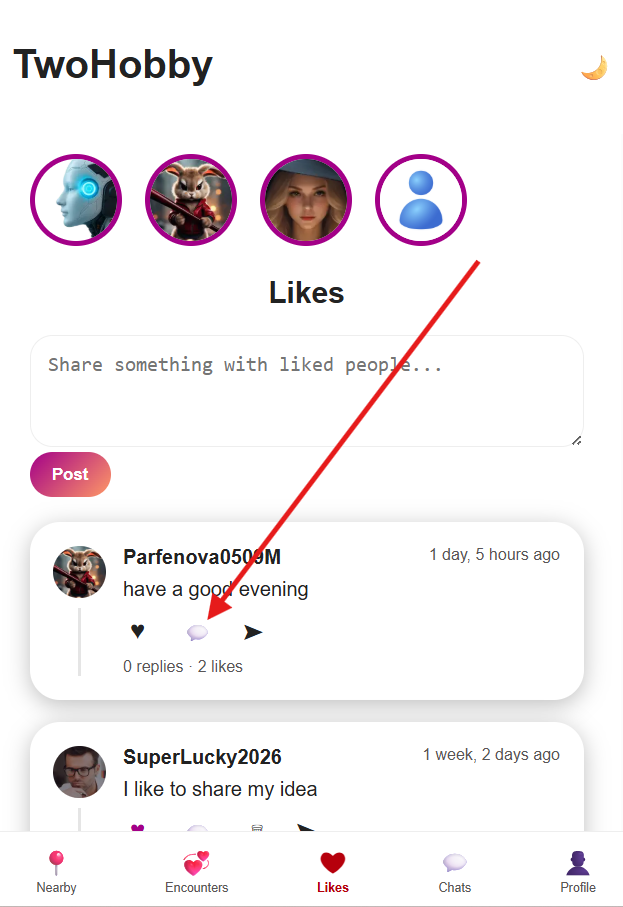 |
| Post Likes | Users can like posts to show engagement. |  |
| Private Messages | Users can send private messages to the post owner/or to the first contact. | 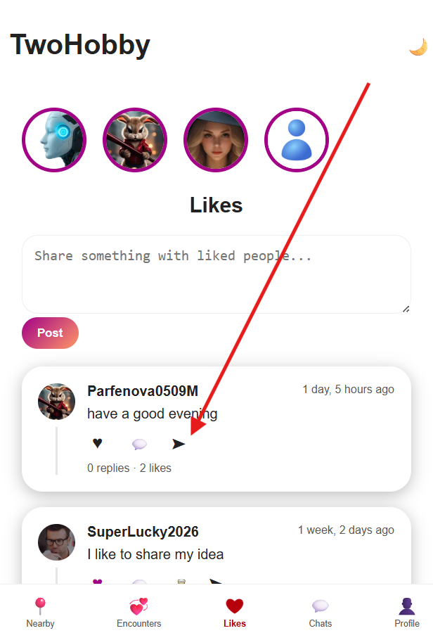 |
| Real-time Chat | Chat messages update through WebSockets for a smoother messaging experience. |  |
| Image Messages | Users can send images in private chat. | 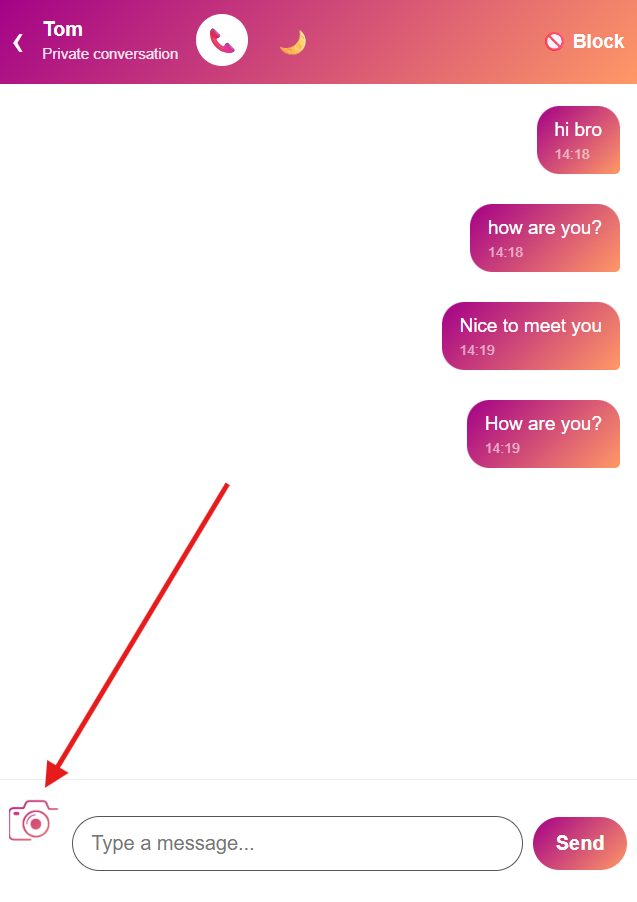 |
| Call Button | The chat interface includes a call button for communication features. | 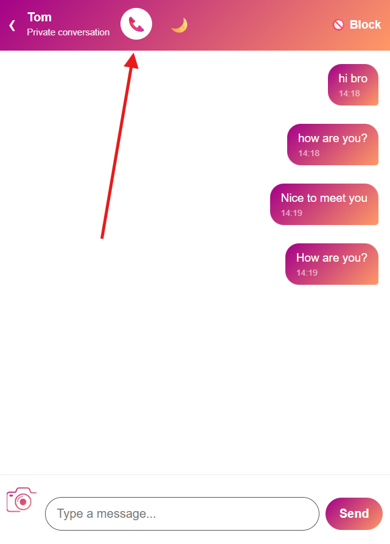 |
| Block / Unblock Users | Users can block or unblock other users for safety and control. | 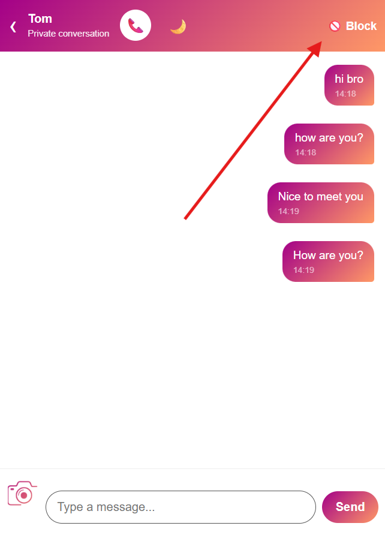 |
| Bottom Navigation | Mobile-style bottom navigation helps users move around the app easily. |  |
| Filter Profiles | Users can filter profiles by gender and age range. |  |
| Admin Panel | Site admins can manage users, profiles, posts, comments, and other app content through Django admin. | 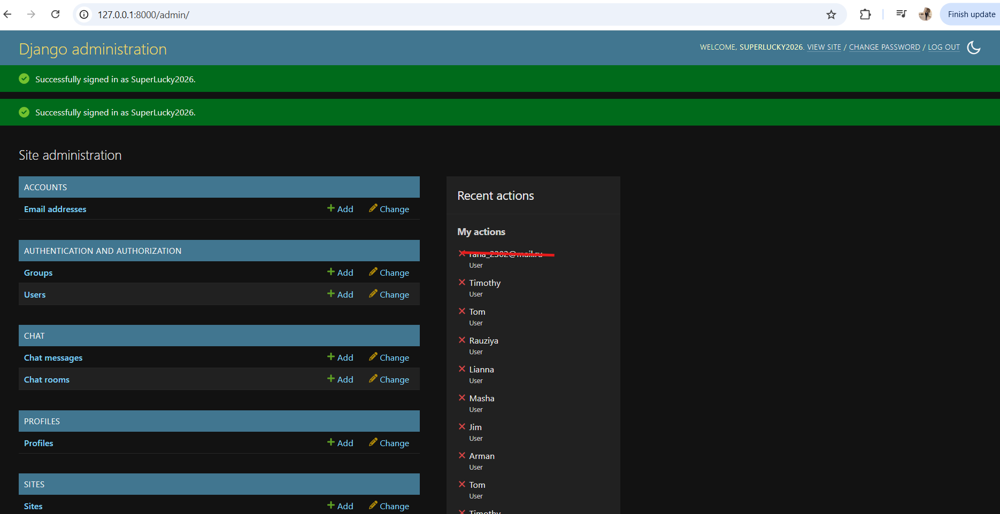 |

### Future Features

| Feature | Notes |
|---|---|
| Notifications | Notify users about new likes, comments, messages, and profile interactions. |
| Search Profiles | Add search by name, location, hobbies, or interests. |
| Advanced Filters | Allow filtering by distance, hobbies, activity status, and relationship preferences. |
| Online Status | Show whether a user is online or recently active. |
| Improved Calls | Improve voice/video call functionality and call notifications. |
| Message Read Status | Show when a message has been delivered or read. |
| Emoji Picker | Add an emoji keyboard for desktop users. |
| Profile Verification | Add verification badges to make profiles more trustworthy. |
| Report User | Allow users to report inappropriate profiles, posts, comments, or messages. |
| Admin Dashboard | Add statistics for users, posts, messages, reports, and activity. |
| Push Notifications | Send browser or mobile notifications for new messages and likes. |
| Location Improvements | Improve distance accuracy and location privacy settings. |
| Mobile App | Develop TwoHobby as a mobile app for iOS and Android. |
| Social Login | Allow users to sign in with Google or other social accounts. |


## User Authentication
- User registration and login
- Secure authentication using Django Allauth
- Profile management
- Logout functionality

## User Profiles
- Profile image uploads
- Custom bio and personal information
- Age, location, and interests
- Responsive mobile-friendly profile cards

## Real-Time Chat
- WebSocket-powered messaging
- Django Channels integration
- Instant message updates
- Private chat rooms

## Voice & Call Features
- WebRTC voice communication
- Echo cancellation support
- Noise suppression
- Real-time audio streaming

## Media Handling
- Cloudinary integration
- Automatic image optimization
- WebP image support
- Reduced bandwidth usage

## Responsive Design
- Mobile-first layout
- Tinder/Badoo-inspired interface
- Optimized for Android and iPhone
- Dynamic grid system

---

# Technologies Used

## Backend
- Python
- Django
- Django Channels
- Daphne
- Redis

## Frontend
- HTML5
- CSS3
- JavaScript
- WebSockets
- WebRTC

## Database
- PostgreSQL

## Media & Deployment
- Cloudinary
- Heroku
- WhiteNoise

---


## Database Design

### Data Model

The central models in TwoHobby are `Profile`, `ChatRoom`, `ChatMessage`, `Post`, and `Comment`, which together power the social, messaging, and interaction features of the platform.

The `Profile` model extends Django’s built-in `User` model using a one-to-one relationship. It stores additional user information such as display name, age, bio, gender, location, profile image, hobbies, and relationship preferences.

The `Post` model allows users to create social posts connected to their profile. Posts can include text content, images, timestamps, and user interactions such as likes and comments.

The `Comment` model connects to both `Post` and `User`, allowing authenticated users to participate in discussions under posts.

The `ChatRoom` and `ChatMessage` models handle the real-time messaging system. `ChatRoom` stores private conversations between users, while `ChatMessage` stores individual messages, timestamps, images, and sender information. These models work together with Django Channels and WebSockets to provide live chat functionality.

The likes system connects users with profiles and posts they interact with, allowing the application to display liked profiles and create social engagement features.

The blocking system links users together through a `BlockedUser` model, allowing users to block or unblock other members for safety and privacy.

Django’s built-in `User` model is used for authentication, registration, login, logout, and permission handling throughout the project.

I used [dbdiagram.io](https://dbdiagram.io/) to design the Entity Relationship Diagram (ERD) and referenced it throughout development to maintain a clear database structure and relationships between models.


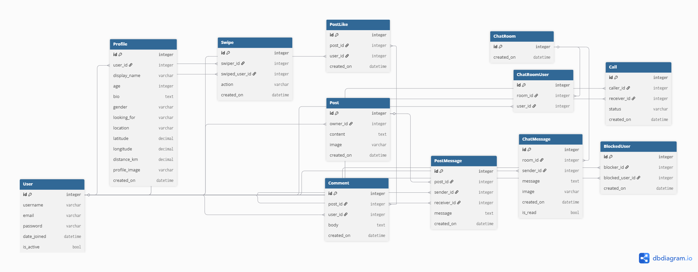

## Agile Development Process
---

## GitHub Projects

GitHub Projects was used as an Agile tool throughout the development of TwoHobby. EPICs, User Stories, feature tasks, and bug fixes were planned and organised using a Kanban project board. Progress was tracked regularly through the Todo, In Progress, and Done sections to manage development workflow and monitor completed features.

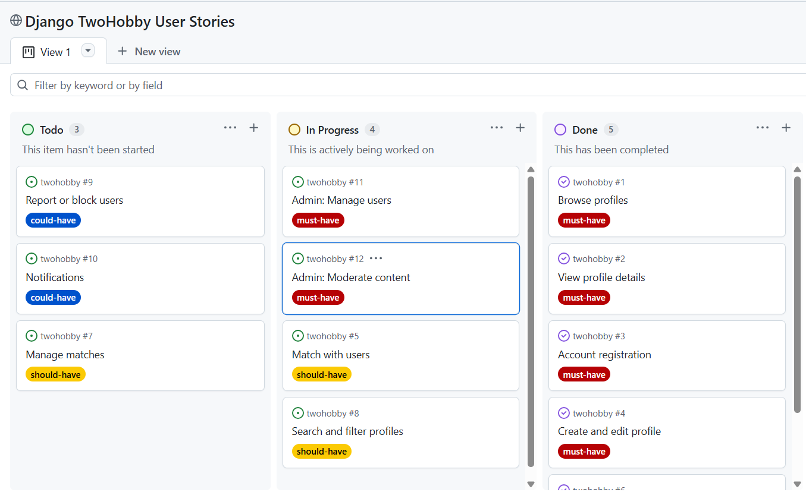

## GitHub Issues

GitHub Issues was used as an additional Agile tool throughout the development of TwoHobby. User Stories, feature tasks, bug fixes, and milestone objectives were managed and tracked using GitHub Issues to organise the development process and monitor progress.

| Link | Screenshot |
|---|---|
| GitHub Issues | 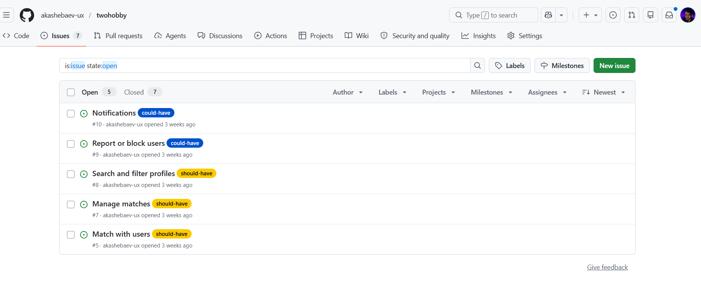 |
| Closed Issues | 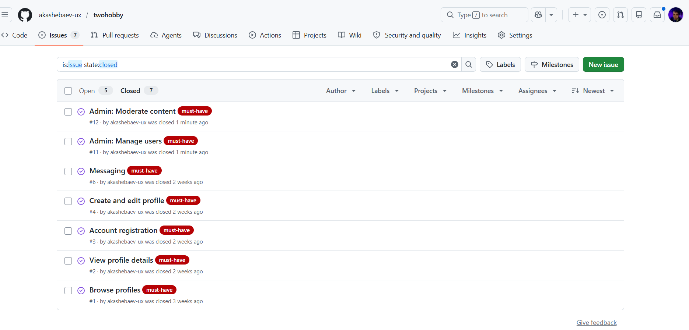 |

## MoSCoW Prioritization

Project features and functionality were organised into User Stories and prioritised using the MoSCoW prioritization method. This approach helped structure development tasks according to project goals and user needs.

Each User Story was created to support one or more core project objectives identified during the planning and strategy stages of development.

- **Must Have**: Essential features required for the core functionality of the application.
- **Should Have**: Important features that add significant value but are not critical.
- **Could Have**: Additional improvements that enhance the user experience but are not necessary for launch.
- **Won't Have**: Features planned for future development iterations.

As development progressed, User Stories were moved across the Kanban board between Todo, In Progress, and Done stages. Labels were used to organise EPICs, feature categories, priorities, and development tasks.

| Screenshot | Description |
|---|---|
| 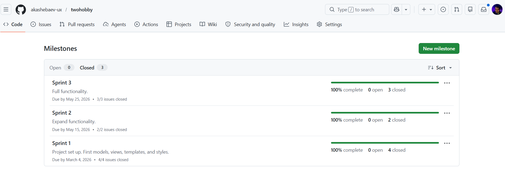 | Milestones and project planning |
| 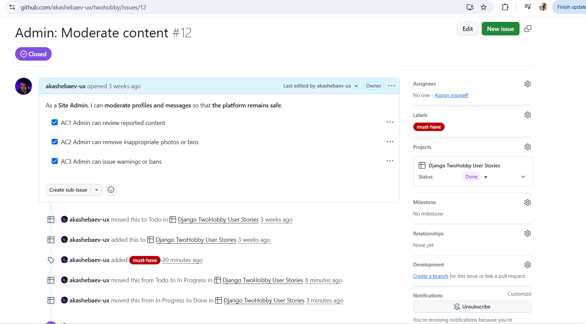 | Issue history and completed tasks |


---

# Project Structure

```bash
twohobby/
│
├── chat/
├── profiles/
├── static/
├── templates/
├── media/
├── config/
│
├── manage.py
├── requirements.txt
├── Procfile
└── README.md
```

---

# Installation

## Clone Repository

```bash
git clone https://github.com/akashebaev-ux/twohobby.git
cd twohobby
```

---

## Create Virtual Environment

```bash
python -m venv .venv
```

Activate virtual environment:

### Windows

```bash
.venv\Scripts\activate
```

### Mac/Linux

```bash
source .venv/bin/activate
```

---

## Install Dependencies

```bash
pip install -r requirements.txt
```

---

# Environment Variables

Create an `env.py` file or use Heroku Config Vars.

Example:

```python
import os

os.environ.setdefault("SECRET_KEY", "your_secret_key")
os.environ.setdefault("DATABASE_URL", "your_database_url")
os.environ.setdefault("CLOUDINARY_URL", "your_cloudinary_url")
os.environ.setdefault("REDIS_URL", "redis://127.0.0.1:6379")
```

---

# Database Migration

```bash
python manage.py makemigrations
python manage.py migrate
```

---

# Create Superuser

```bash
python manage.py createsuperuser
```

---

# Running the Project

## Local Development

```bash
python manage.py runserver
```

## WebSocket Server

```bash
daphne config.asgi:application
```

---

# Redis Setup

## Using Podman

```bash
podman run -d \
  --name redis \
  -p 6379:6379 \
  docker.io/library/redis
```

---

# Deployment

The application is deployed using:
- Heroku
- Cloudinary
- PostgreSQL

## Heroku Deployment

```bash
heroku login
heroku create your-app-name
git push heroku main
```

---

# WebSocket Architecture

```text
Client
   ↓
WebSocket Connection
   ↓
Django Channels
   ↓
Redis Channel Layer
   ↓
Connected Users
```

---

# Security Features

- CSRF protection
- Secure authentication
- User validation
- Private chat access control
- Protected WebSocket connections

---

# Future Improvements

- Video calls
- Matching system
- AI translation
- Push notifications
- Advanced search filters
- User verification
- Voice message translation
- Mobile application release

---

# Testing
Detailed testing documentation can be found in [TESTING.md](TESTING.md).

## Manual Testing
- Authentication testing
- Chat functionality testing
- Mobile responsiveness
- Image upload validation
- WebRTC audio testing

## Code Quality
- PEP8 validation
- Django system checks
- Responsive UI testing

---

# Credits

## Frameworks & Libraries
- Django
- Django Channels
- Redis
- Cloudinary
- WebRTC

## Inspiration
- Badoo
- Tinder
- Modern social networking platforms

---

# Author

**Azamat Kashebayev**

- Full Stack Developer
- Django & Python Enthusiast
- Real-Time Communication Systems

---

# License

This project is for educational and portfolio purposes.
