# TwoHobby – Social & Dating Platform

## Overview

**TwoHobby** is a modern social connection platform inspired by real-time communication apps and social discovery systems.

The platform combines elements of community-driven applications such as Threads with the discovery-based experience of platforms like Badoo and Tinder. Its goal is to create a more meaningful and private environment where people can connect through shared interests, hobbies, values, and authentic interaction.

TwoHobby allows users to share thoughts, posts, and experiences exclusively with people they have marked as liked. Only liked users can exchange feedback, ideas, and private messages within their social circle, creating a more personal and engaging communication environment.

The platform is designed to encourage genuine social interaction beyond traditional dating-focused applications. By combining hobby-based discovery, private social networking, instant messaging, and real-time communication features, TwoHobby creates a space where users can build friendships, relationships, and communities based on common ground.


Built as a responsive full-stack web application, TwoHobby integrates scalable communication technologies and optimized media delivery to provide a smooth user experience across desktop and mobile devices.

---

## Project Philosophy

TwoHobby is designed as a free-to-use social platform with a scalable and cost-efficient infrastructure capable of supporting thousands of users while maintaining relatively low operational costs.

The philosophy behind the platform is simple:

Human connection, emotions, and the opportunity to build meaningful relationships — including finding a soulmate — should never be unnecessarily restricted or hidden behind expensive barriers.

---

## Project Focus

This project focuses on:

- Real-time communication
- Responsive mobile-first user experience
- Scalable communication systems
- Optimized media delivery
- Private and meaningful social interaction
- Full-stack web development practices
- Efficient and cost-optimized infrastructure design

---

# Features


## Features

### Existing Features

| Feature | Notes | Screenshot |
|---|---|---|
| Register | Users can create an account using Django allauth. |  |
| Login | Existing users can log in and access protected pages. | 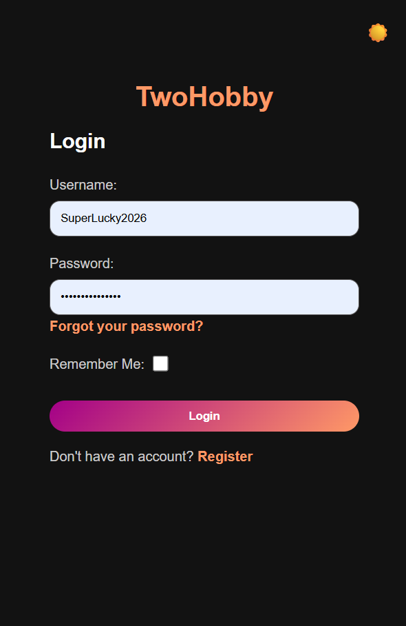 |
| Logout | Logged-in users can securely log out using the logout button on their profile page. | 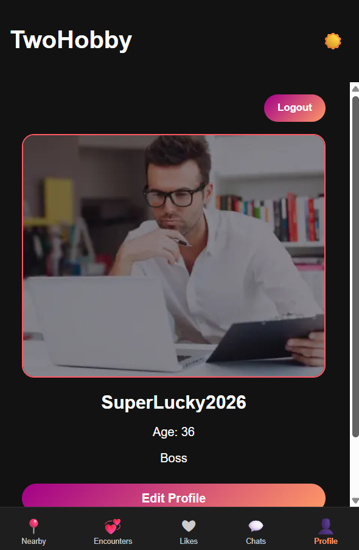 |
| Responsive Layout | The website is designed to work on desktop, tablet, but mainly on mobile screens. | 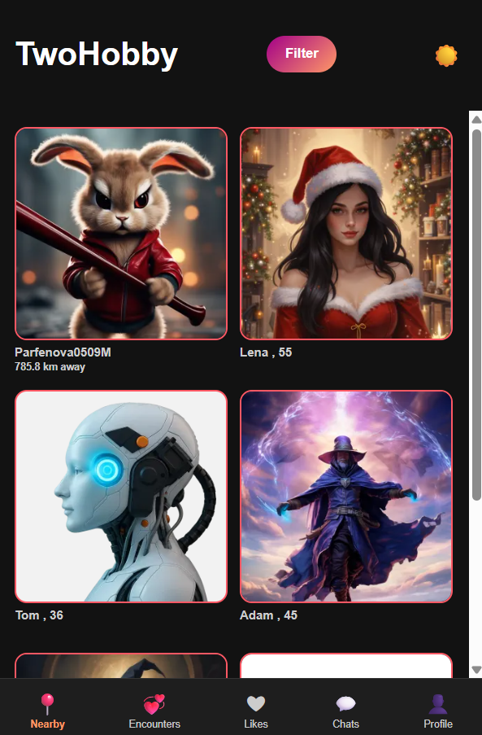 |
| Dark / Light Mode | Users can switch between light and dark mode for a better viewing experience. | 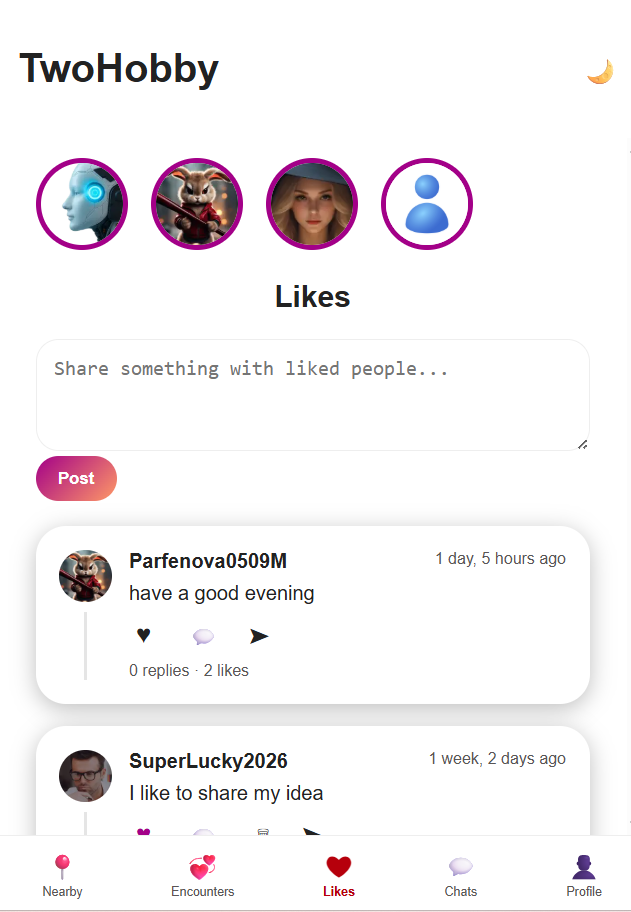|
| Nearby | Users can browse nearby profiles and see profile cards. | 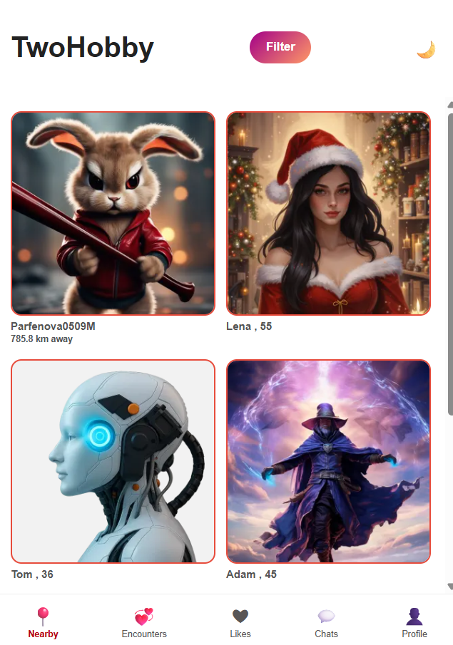 |
| Profile | Users can see their own profile image, name, age, and bio. | 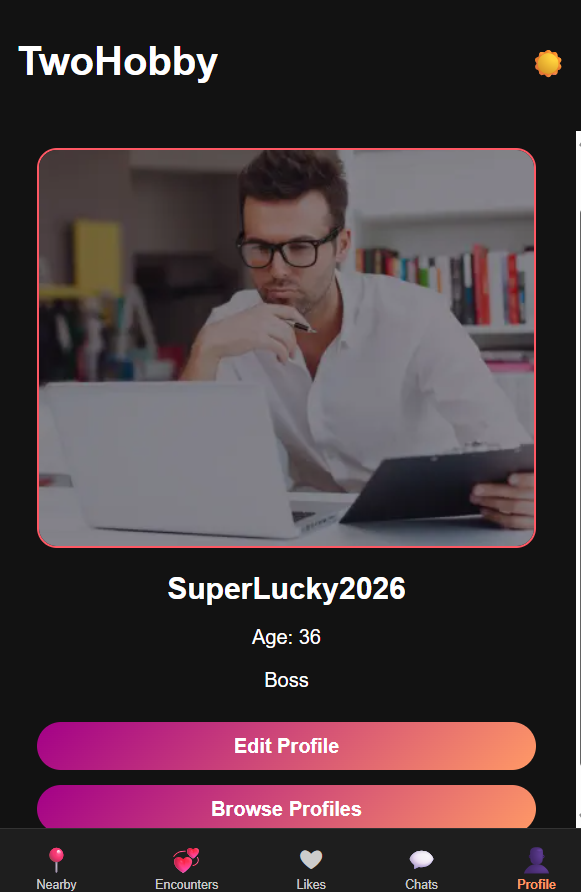 |
| Profile Detail | Users can open a full profile page to see more information about another user. | 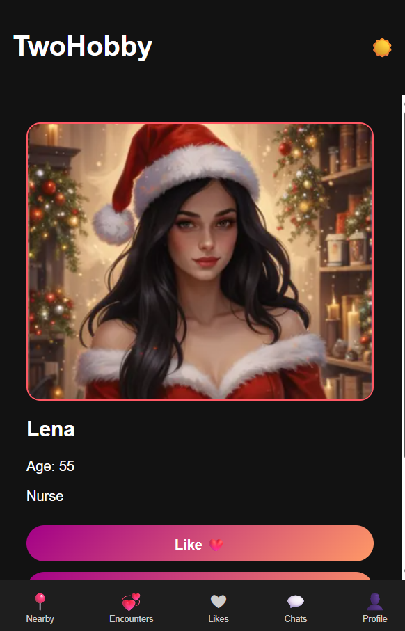 |
| Edit Profile | Users can update their own profile information and profile image. | 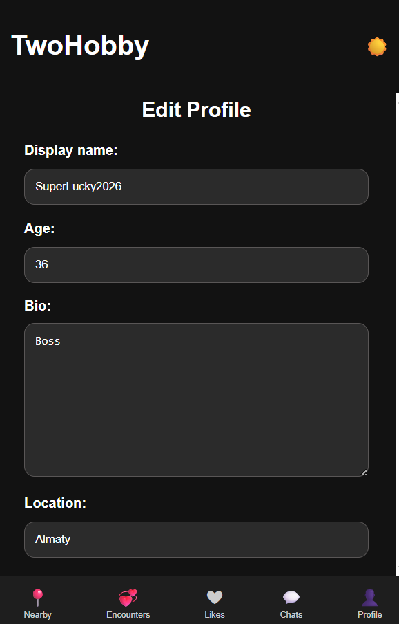 |
| Encounters | Users can like other profiles to show interest. |  |
| Likes | Users can view profiles they have liked and create group posts where only liked profiles can view and comment on them. |  |
| Posts | Users can create posts connected to their profile and interests. | 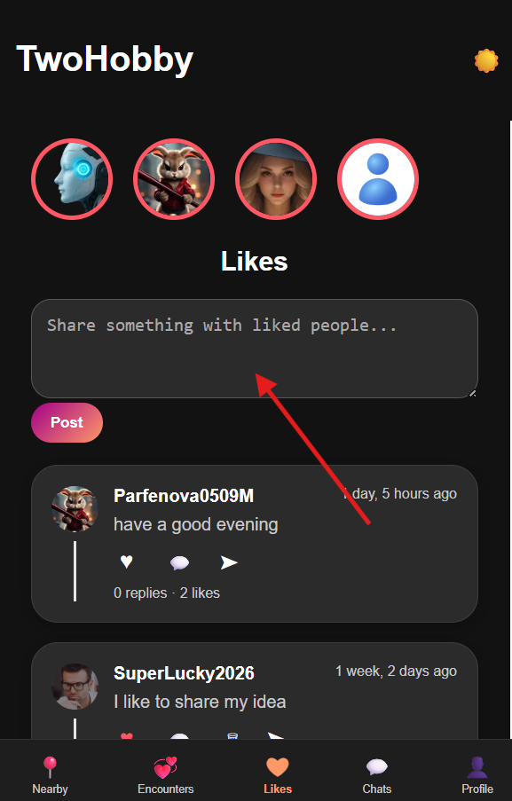 |
| Comments | Users can comment on posts and interact with other users. |  |
| Post Likes | Users can like posts to show engagement. | 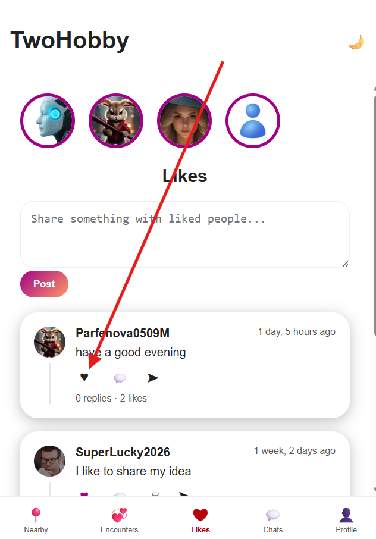 |
| Private Messages | Users can send private messages to the post owner/or to the first contact. |  |
| Real-time Chat | Chat messages update through WebSockets for a smoother messaging experience. | 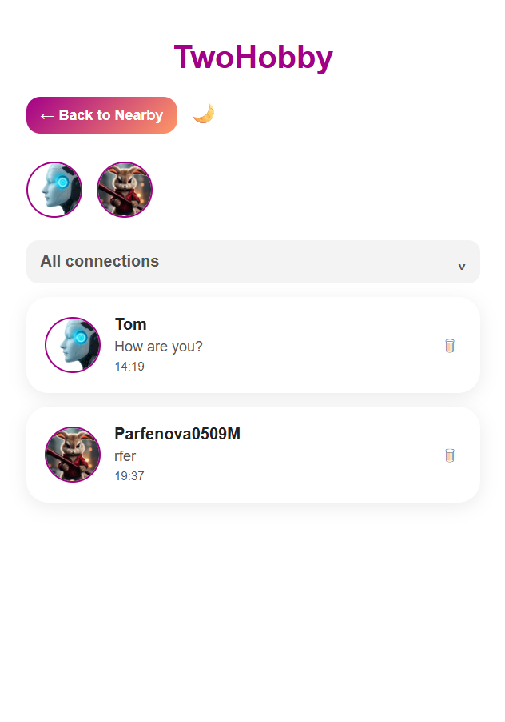 |
| Image Messages | Users can send images in private chat. |  |
| Call Button | The chat interface includes a call button for communication features. |  |
| Block / Unblock Users | Users can block or unblock other users for safety and control. |  |
| Bottom Navigation | Mobile-style bottom navigation helps users move around the app easily. | 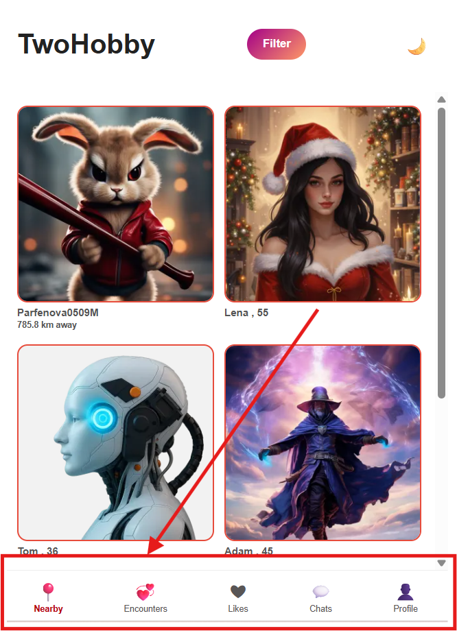 |
| Filter Profiles | Users can filter profiles by gender and age range. | 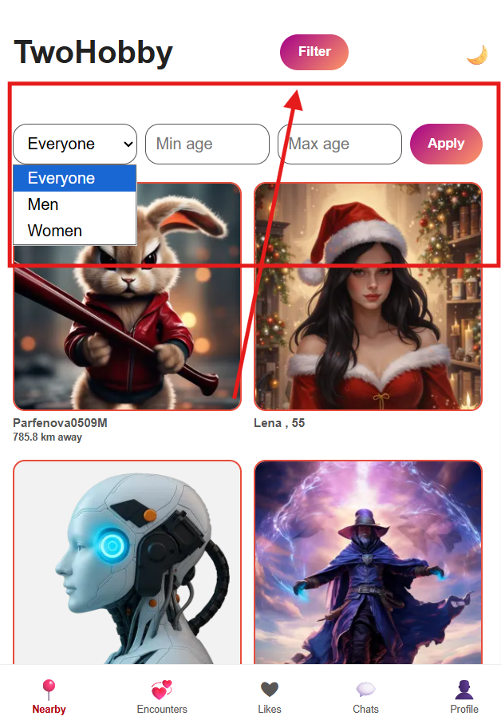 |
| Admin Panel | Site admins can manage users, profiles, posts, comments, and other app content through Django admin. |  |

### Future Features

| Feature | Notes |
|---|---|
| Notifications | Notify users about new likes, comments, messages, and profile interactions. |
| Search Profiles | Add search by name, location, hobbies, or interests. |
| Advanced Filters | Allow filtering by distance, hobbies, activity status, and relationship preferences. |
| Online Status | Show whether a user is online or recently active. |
| Improved Calls | Improve voice/video call functionality and call notifications. |
| Message Read Status | Show when a message has been delivered or read. |
| Emoji Picker | Add an emoji keyboard for desktop users. |
| Profile Verification | Add verification badges to make profiles more trustworthy. |
| Report User | Allow users to report inappropriate profiles, posts, comments, or messages. |
| Admin Dashboard | Add statistics for users, posts, messages, reports, and activity. |
| Push Notifications | Send browser or mobile notifications for new messages and likes. |
| Location Improvements | Improve distance accuracy and location privacy settings. |
| Mobile App | Develop TwoHobby as a mobile app for iOS and Android. |
| Social Login | Allow users to sign in with Google or other social accounts. |


## User Authentication
- User registration and login
- Secure authentication using Django Allauth
- Profile management
- Logout functionality

## User Profiles
- Profile image uploads
- Custom bio and personal information
- Age, location, and interests
- Responsive mobile-friendly profile cards

## Real-Time Chat
- WebSocket-powered messaging
- Django Channels integration
- Instant message updates
- Private chat rooms

## Voice & Call Features
- WebRTC voice communication
- Echo cancellation support
- Noise suppression
- Real-time audio streaming

## Media Handling
- Cloudinary integration
- Automatic image optimization
- WebP image support
- Reduced bandwidth usage

## Responsive Design
- Mobile-first layout
- Tinder/Badoo-inspired interface
- Optimized for Android and iPhone
- Dynamic grid system

---

# Technologies Used

## Backend
- Python
- Django
- Django Channels
- Daphne
- Redis

## Frontend
- HTML5
- CSS3
- JavaScript
- WebSockets
- WebRTC

## Database
- PostgreSQL

## Media & Deployment
- Cloudinary
- Heroku
- WhiteNoise

---

# Project Structure

```bash
twohobby/
│
├── chat/
├── profiles/
├── static/
├── templates/
├── media/
├── config/
│
├── manage.py
├── requirements.txt
├── Procfile
└── README.md
```

---

# Installation

## Clone Repository

```bash
git clone https://github.com/yourusername/twohobby.git
cd twohobby
```

---

## Create Virtual Environment

```bash
python -m venv .venv
```

Activate virtual environment:

### Windows

```bash
.venv\Scripts\activate
```

### Mac/Linux

```bash
source .venv/bin/activate
```

---

## Install Dependencies

```bash
pip install -r requirements.txt
```

---

# Environment Variables

Create an `env.py` file or use Heroku Config Vars.

Example:

```python
import os

os.environ.setdefault("SECRET_KEY", "your_secret_key")
os.environ.setdefault("DATABASE_URL", "your_database_url")
os.environ.setdefault("CLOUDINARY_URL", "your_cloudinary_url")
os.environ.setdefault("REDIS_URL", "redis://127.0.0.1:6379")
```

---

# Database Migration

```bash
python manage.py makemigrations
python manage.py migrate
```

---

# Create Superuser

```bash
python manage.py createsuperuser
```

---

# Running the Project

## Local Development

```bash
python manage.py runserver
```

## WebSocket Server

```bash
daphne config.asgi:application
```

---

# Redis Setup

## Using Podman

```bash
podman run -d \
  --name redis \
  -p 6379:6379 \
  docker.io/library/redis
```

---

# Deployment

The application is deployed using:
- Heroku
- Cloudinary
- PostgreSQL

## Heroku Deployment

```bash
heroku login
heroku create your-app-name
git push heroku main
```

---

# WebSocket Architecture

```text
Client
   ↓
WebSocket Connection
   ↓
Django Channels
   ↓
Redis Channel Layer
   ↓
Connected Users
```

---

# Security Features

- CSRF protection
- Secure authentication
- User validation
- Private chat access control
- Protected WebSocket connections

---

# Future Improvements

- Video calls
- Matching system
- AI translation
- Push notifications
- Advanced search filters
- User verification
- Voice message translation
- Mobile application release

---

# Testing

## Manual Testing
- Authentication testing
- Chat functionality testing
- Mobile responsiveness
- Image upload validation
- WebRTC audio testing

## Code Quality
- PEP8 validation
- Django system checks
- Responsive UI testing

---

# Credits

## Frameworks & Libraries
- Django
- Django Channels
- Redis
- Cloudinary
- WebRTC

## Inspiration
- Badoo
- Tinder
- Modern social networking platforms

---

# Author

**Azamat**

- Full Stack Developer
- Django & Python Enthusiast
- Real-Time Communication Systems

---

# License

This project is for educational and portfolio purposes.
