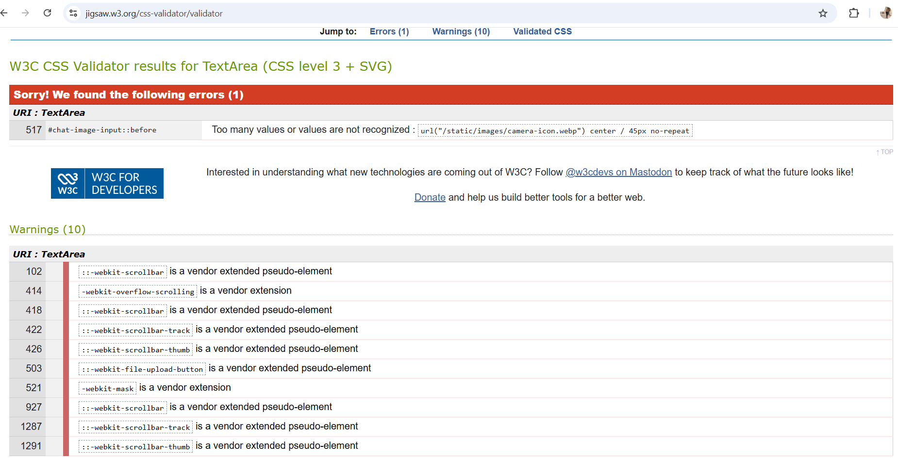
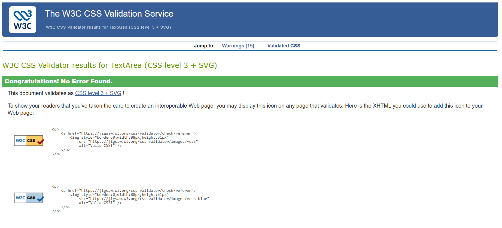

# Testing

## Note

Return back to the `README.md` file.

---

# Code Validation

## HTML

I used the recommended HTML W3C Validator to validate all HTML files throughout the project. Several validation issues appeared initially and were resolved during development. Remaining informational warnings related to trailing slashes on void elements are automatically generated by Cloudinary and cannot be removed manually.

| Directory | File | Validator | Screenshot | Notes |
|---|---|---|---|---|
| templates | landing.html | Link to validator |  | No errors found |
| templates | password_reset.html | Link to validator |  | No errors found |
| templates | success.html | Link to validator |  | No errors found |
| nearby | nearby.html | Link to validator |  | No errors found |
| encounters | encounters.html | Link to validator |  | No errors found |
| chat | messages.html | Link to validator |  | No errors found |
| chat | chat_room.html | Link to validator |  | No errors found |
| profiles | profile_detail.html | Link to validator |  | No errors found |
| profiles | edit_profile.html | Link to validator |  | No errors found |
| likes | likes.html | Link to validator |  | No errors found |
| templates | signup.html | Link to validator |  | No errors found |
| templates | login.html | Link to validator |  | No errors found |
| templates | logout.html | Link to validator |  | No errors found |

---

## Initial Validation Errors and Fixes

| Page | Errors | Actions Taken |
|---|---|---|
| signup.html |  | Added missing form element IDs and improved accessibility structure for validation compliance |
| chat_room.html |  | Removed invalid nested HTML elements and corrected unclosed tags |
| likes.html |  | Fixed unclosed `
` elements and removed duplicate attributes |
| messages.html |  | Corrected invalid layout structure and removed improperly nested container elements |
| 404.html |  | Fixed profile access handling to prevent server errors for anonymous users |

---

## CSS

I used the recommended CSS Jigsaw Validator to validate all custom CSS files used throughout the project.

When validating by direct input, the validator returned several vendor-extension warnings related to WebKit-specific properties and pseudo-elements. These warnings are expected and were intentionally used to improve browser compatibility and mobile user experience.

One validation error was also identified and corrected during development.

---

### Initial CSS Validation Error

| Line | Error | Fix Applied |
|---|---|---|
| 517 | `Too many values or values are not recognized` caused by shorthand background syntax | Replaced unsupported shorthand syntax with separate `background-image`, `background-position`, `background-size`, and `background-repeat` properties |

---

### CSS Validation Warnings

The remaining warnings are related to vendor-specific extensions such as:

- `::-webkit-scrollbar`
- `::-webkit-scrollbar-thumb`
- `::-webkit-scrollbar-track`
- `-webkit-overflow-scrolling`
- `::-webkit-file-upload-button`
- `-webkit-mask`

These are intentional browser-specific enhancements used for custom scrollbars, mobile scrolling behavior, and improved UI styling compatibility.

---

### CSS Validation Results

| Directory | File | Screenshot | Notes |
|---|---|---|---|
| static/css | style.css |  | Warnings relate to vendor-specific WebKit extensions and CSS variables |

## Lighthouse Audit

I tested my deployed project using the Lighthouse Audit tool to identify any major performance, accessibility, SEO, or best practice issues.

Any issues that could be improved were reviewed and addressed where possible.

| Page | White Mode | Dark Mode |
|---|---|---|
| Landing |  |  |
| Signup |  |  |
| Login |  |  |
| Password Reset |  |  |
| Success Page |  |  |
| Nearby Profiles |  |  |
| Profile Detail |  |  |
| Encounters |  |  |
| Likes |  |  |
| Messages |  |  |
| Chat Room |  |  |
| My Profile |  |  |
| Edit Profile |  |  |

